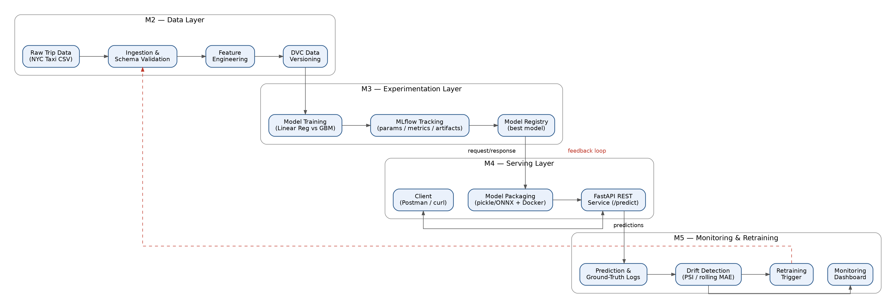

# Ride ETA Prediction — End-to-End ML Pipeline
**Flavor A | Machine Learning Engineering (PCAM* ZC412) — EC-1 Mini-Project**

Predicts ride/delivery ETA from trip distance, time-of-day, weather, traffic and
pickup/drop-off location, served as a REST API with experiment tracking, drift
monitoring and a retraining trigger.

## Architecture


See [`docs/architecture-and-design.docx`](docs/architecture-and-design.docx) for
the full design document.

## Quickstart
```bash
git clone <repo-url> && cd <repo>
python -m venv .venv && source .venv/bin/activate
pip install -r requirements.txt

# 1. Data pipeline
python src/data/ingest.py --config config/config.yaml
python src/features/build_features.py --config config/config.yaml
dvc add data/processed/train.parquet && dvc push

# 2. Train + track experiments
python src/models/train.py --config config/config.yaml
mlflow ui   # inspect runs at http://localhost:5000

# 3. Serve the best model
docker compose -f docker/docker-compose.yml up --build
curl -X POST http://localhost:8000/predict -H "Content-Type: application/json" \
     -d @data/samples/sample_request.json

# 4. Monitor + simulate drift
python src/monitoring/log_predictions.py
python src/monitoring/detect_drift.py
```

## Repository layout
See [`docs/repo-structure.md`](docs/repo-structure.md) for the annotated tree.

## Team / Academic integrity
Group members, dataset citation and third-party libraries are listed in
[`docs/references.md`](docs/references.md).
